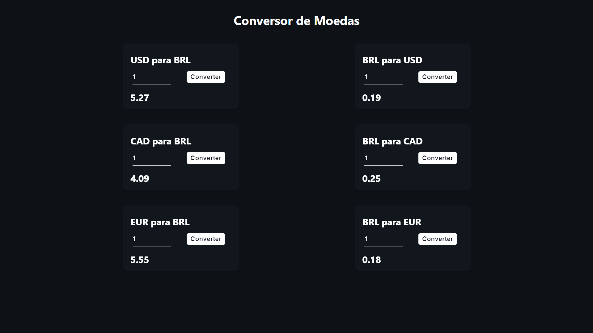

<h1 align="center">Converter 🪙</h1>

🚀 Programa de conversão de moedas com feito com Vite ReactJS trabalhando com uma API

 <a href="#objetivo">Objetivo</a> •
 <a href="#roadmap">Roadmap</a> • 
 <a href="#acesso">Acesso</a> • 
 <a href="#tecnologias">Tecnologias</a>

<h2 id="objetivo">✅ Objetivo </h2>

Conversor de moedas BRL para EUR CAD USD, facilitar questões do usuário com componentes sempre atualizados!!

<h2 id="roadmap">🐱‍🏍 Roadmap</h2>

  - [x] Criar Index

  - [x] Criar CSS

  - [x] Criar JS

  - [x] Versão desktop

  - [ ] Versão mobile

  - [ ] White Mode

  - [ ] Postar site no ar

  - [x] Relatório README completo

<h1 align="center">
    
</h1>

 

<h2 id="acesso">📁 Acesso ao projeto React</h2>

`download this project`

Abra o repositorio e baixe [https://github.com/maarcusvinicius/Converter](https://github.com/maarcusvinicius/Converter)

 

<h2>🎡 Abrir e rodar o projeto</h2>

`npm run dev`

Runs the app in the development mode.\
Open [http://localhost:3000](http://localhost:3000) to view it in your browser.

 

<h2 id="tecnologias"> 🛠 Tecnologias </h2>

As seguintes ferramentas foram usadas na construção do projeto:
  

  
  
  

  
<h4 align="center"> 
	✅  Converter 🪙 FINALIZADO  ✅
</h4>
 

Feito com ❤️ por Marcus Vinicius 👋🏽 Entre em contato!

  
  
  

 

  
#NextLevel
#NeverStopLearning
#NewSkills
#StepByStep
#MissionAccomplished

